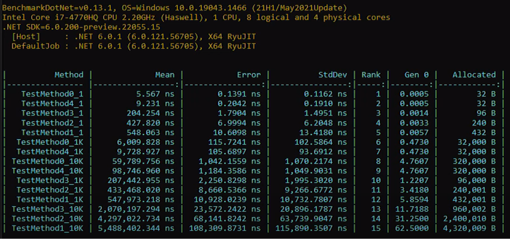

# reflection.perfomance.benchmark

Comparing the performance of creating objects in C# using: Reflection, Activator.CreateInstance and Expression Lambda

[https://www.youtube.com/watch?v=woU_TyNX-Cc](https://www.youtube.com/watch?v=woU_TyNX-Cc)
